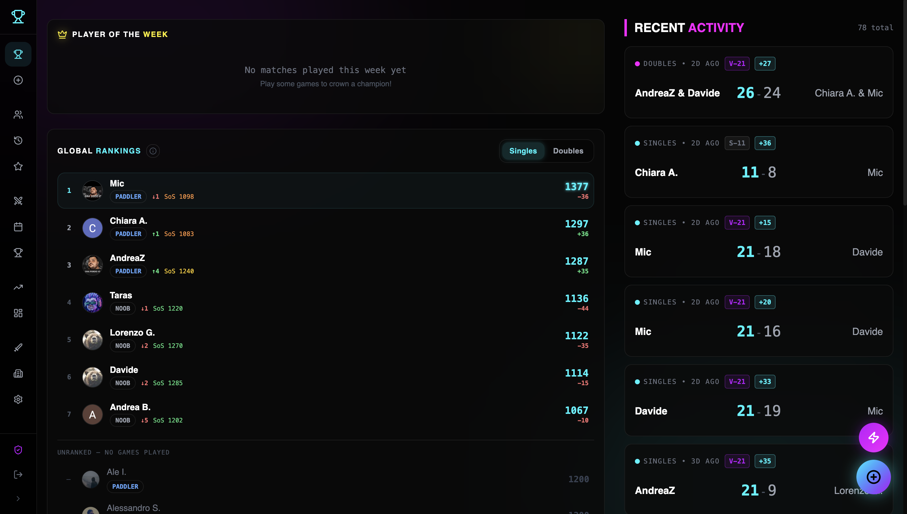
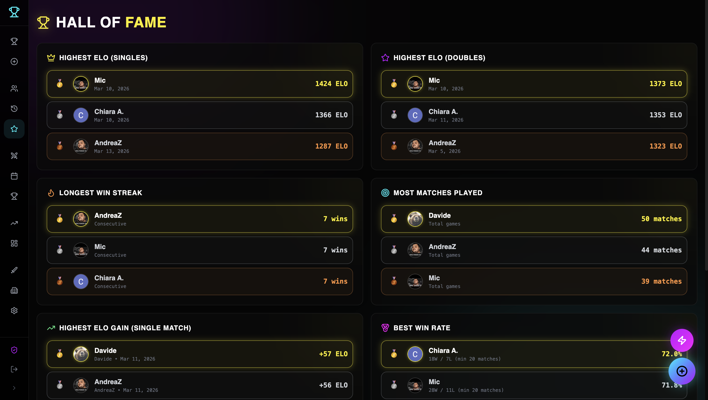
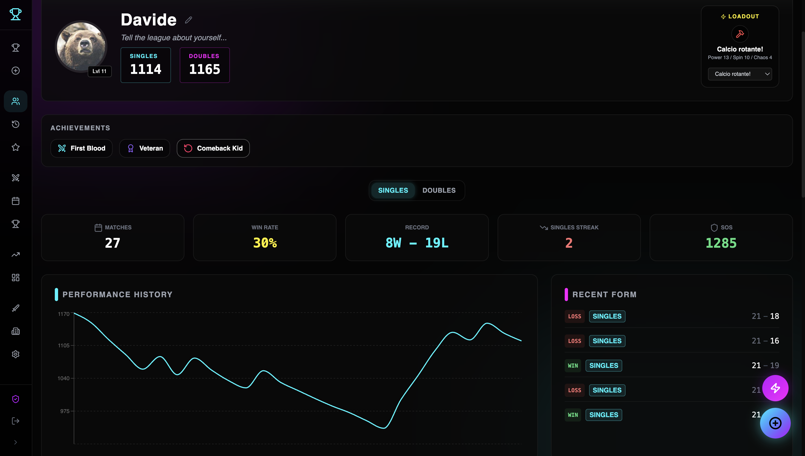
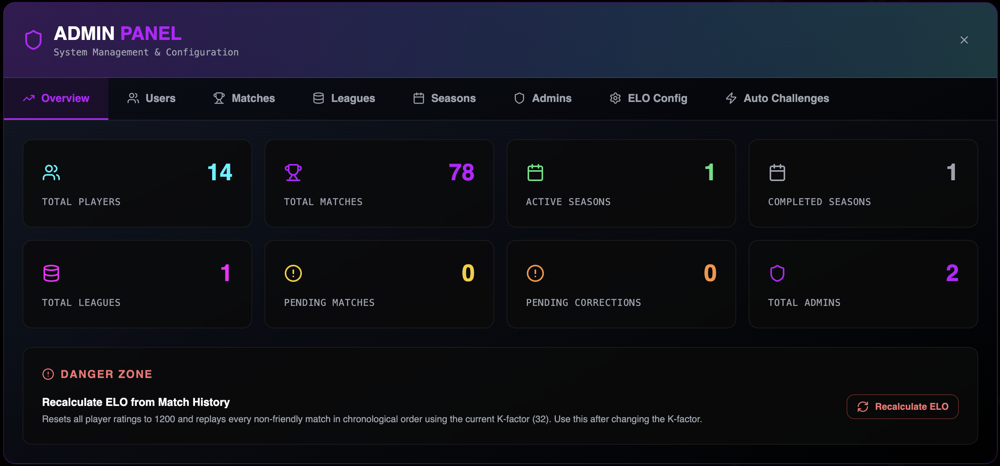

<div align="center">
  <h1>🏓 Cyberpong</h1>
  <p><strong>Arcade League & Matchups Hub</strong></p>

  <p>
    
    
    
    
    
    
    
  </p>
</div>

Welcome to **Cyberpong** – the ultimate platform for managing your arcade league, logging matches, tracking player stats, and climbing the leaderboard.

---

## 📸 Screenshots

1. **Main Dashboard / Matchups Hub**
   

2. **Leaderboard & Ranks**
   

3. **Player Profile & Stats**
   

4. **Admin Panel / Match Logger**
   

---

## 🎯 Quick Start User Guide

Get up and running with Cyberpong in just a few steps:

### 1. Installation
Clone the repository and install the dependencies:
```bash
git clone https://github.com/yourusername/test-pong.git
cd test-pong/source
npm install
```

### 2. Running Locally
Start both the Vite frontend and Express backend concurrently:
```bash
npm run dev
```
> **Note:** The frontend will be available at `http://localhost:5173` and the API at `http://localhost:8080`.

### 3. Usage Basics
1. **Log In:** Access the dashboard using your configured authentication method (Firebase / Google).
2. **Challenge Players:** Head to the Matchups Hub to issue or accept challenges from other players.
3. **Log a Match:** After a game, use the Match Logger to record the score. The leaderboard and player ELO ratings will automatically update!
4. **View Stats:** Click on any player to view their dedicated profile, historical win rates, and head-to-head records.

---

## 📚 Detailed Documentation

Dive deeper into the architecture, setup, and development of Cyberpong. All detailed guides are located in the `docs/` folder:

- 🏗️ **[Architecture Overview](docs/ARCHITECTURE.md)** - High-level system design, client-server separation, and data flows.
- 💻 **[Development Guide](docs/DEVELOPMENT.md)** - Comprehensive setup steps, tech stack breakdown, and dev workflows.
- 🗄️ **[Database Architecture](docs/DATABASE.md)** - Supported database modes (Supabase, GCP Storage, Local).
- 🔌 **[API Reference](docs/API_REFERENCE.md)** - Complete REST API endpoint documentation.
- ☁️ **[GCP Setup](docs/GCP_SETUP.md)** / 🔒 **[GitHub Secrets](docs/GITHUB_SECRETS.md)** - Cloud deployment and CI/CD configuration.
- ⚙️ **[Admin Panel Implementation](docs/ADMIN_PANEL_IMPLEMENTATION.md)** - Details on admin features and season management.
- 📖 **[Agent Guide](docs/AGENT_GUIDE.md)** - Specialized context and patterns for AI coding agents.
- 🚀 **[Usage & Operations](docs/USAGE.md)** - CI/CD deployment pipeline details.

For a centralized index, see the [Docs README](docs/README.md).
